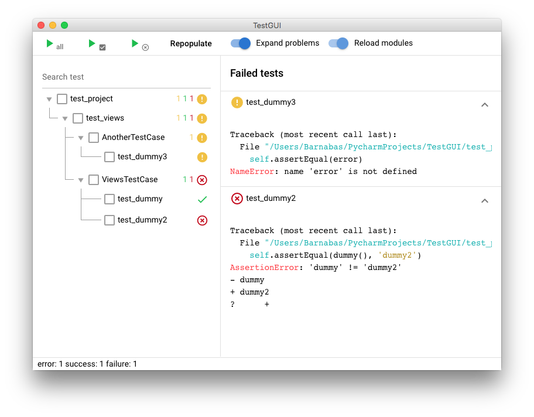

# testgui
Drop-in replacement GUI for Django testing.

### Usage:

replace your management command `test` with `testgui`. It works with the same parameters out of the box. eg.

    python manage.py testgui

Here's a screenshot with TestGUI in operation, after calling python manage.py testgui:

### Installation:

    pip install testgui

Then add testgui to INSTALLED_APPS in settings.py:

    INSTALLED_APPS = [
        ...
        'testgui',
        ...
    ]

#### Dependencies: 

 * django
 * pywebview

 Compatible with redgreenunittest.

#### License:

MIT license

## Features:

- hot module reload* (You don't need to restart testing after you've changed your code.)
- hot test re-population (If you've changed the name of your test or added new tests, still don't need to restart testing.)
- normal debugging (You can still use PyCharm or your favorite IDE to debug your code, just as with manage.py test.)
- run selected test (You just click the icon next to a test or an app and your test runs, don't need to stop debugging.)

*note that unfortunately models.py and admin.py files cannot be hot-reloaded by Django's design. 
However, TestGUI warns you about this and it does not hot-reload these modules.
